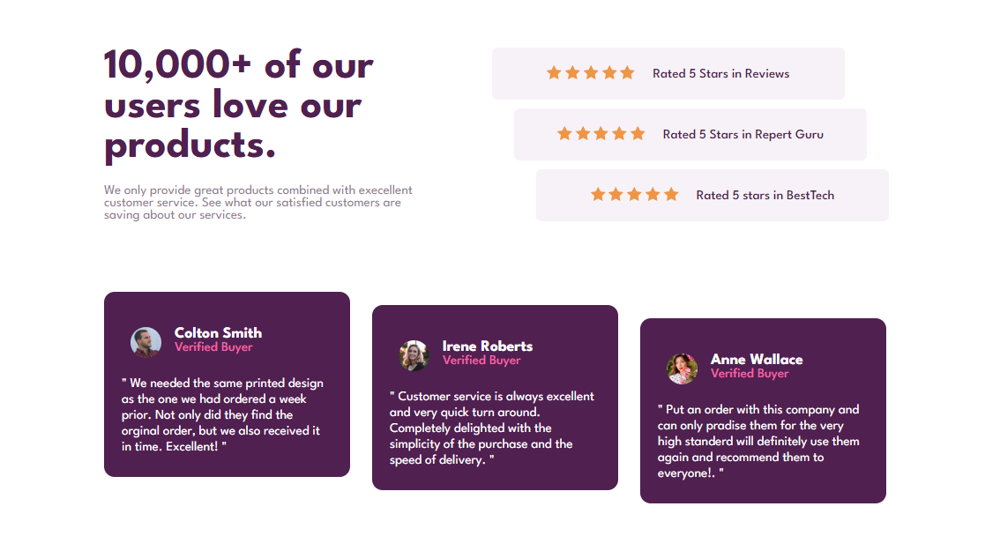
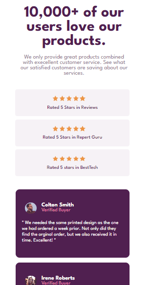

# Frontend Mentor - Social proof section solution

This is a solution to the [Social proof section challenge on Frontend Mentor](https://www.frontendmentor.io/challenges/social-proof-section-6e0qTv_bA). Frontend Mentor challenges help you improve your coding skills by building realistic projects. 

## Table of contents

- [Overview](#overview)
  - [The challenge](#the-challenge)
  - [Screenshot](#screenshot)
  - [Links](#links)
- [My process](#my-process)
  - [Built with](#built-with)
  - [What I learned](#what-i-learned)
  - [Continued development](#continued-development)
- [Author](#author)
- [Acknowledgments](#acknowledgments)

## Overview

This challenge was a little complex, due to the fact that I was in doubt about using some tags and css properties, but other than that the challenge was very easy.

### The challenge

Users should be able to:

- View the optimal layout for the section depending on their device's screen size

### Screenshot

# Desktop

# Mobile

### Links

- Live Site URL: [ => My Github <=](https://ericrdgs.github.io/Social-Proof-Section/)

## My process

At the beginning of the challenge I created the html structure, first I inserted the main tag, then the section tag which will be where the content will be, then I added the div tag in each minisections in the main section. I added h2, h3, h4 and p in each required div.

### Built with

- Semantic HTML5 markup
- CSS custom properties
- Flexbox

### What I learned

In this challenge I had a little difficulty in certain decisions of tags and css properties, I think that after solving this challenge I was able to better learn some properties of flex.

### Continued development

I want to improve my knowledge in flexbox and grid, know how to use them better.

## Author

- Website - [My Github](https://github.com/EricRDGS)
- Frontend Mentor - [@EricRDGS](https://www.frontendmentor.io/profile/EricRDGS)

## Acknowledgments

I was only able to solve this challenge thanks to the double dev, through their course, the DevQuest course.
